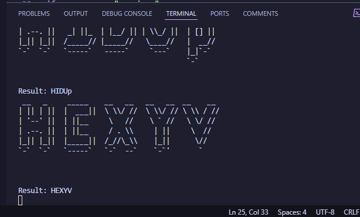

# Leak-lookup.com Research
Mainly the captcha inside the [login page](https://leak-lookup.com/account/login).

> [!NOTE]
> leak-lookup.com could change their ASCII Fig-font, this project is un-tested with alternative fonts.
> Only tested & supported font is `zend-framework.flf`

## Research into string patterns
After querying GitHub for about 5 minutes I located the font they're using: [zend-framework.flf](https://github.com/chkashif167/creo/blob/e79bb05fc7356c9806b0e3cfb0c4eabb58410096/lib/Zend/Text/Figlet/zend-framework.flf).

## ASCII solver
### Font Parsing
The FLF class parses the Zend Framework FIGlet font file and provides methods to render ASCII art for any character.
### Pattern Creation
The solver creates a database of character patterns by generating the ASCII art for each letter using the font parser.
### Matching Algorithm
When given a captcha, the solver:
   - Slides a window across the ASCII art
   - Compares each window to all known character patterns
   - Calculates a similarity score for each potential match
   - Selects the character with the highest score above a threshold
### Demo

# Legal Disclaimer
This repository is intended for educational and research purposes only. The code and content provided here are not affiliated with, endorsed by, or associated with [leak-lookup.com](https://leak-lookup.com) or any related entities.

If you are a representative of leak-lookup.com and believe this repository violates your rights or terms of service, please contact me at [**legal@sys32.dev**](mailto://legal@sys32.dev) to request its removal. I will respond promptly to resolve the issue.